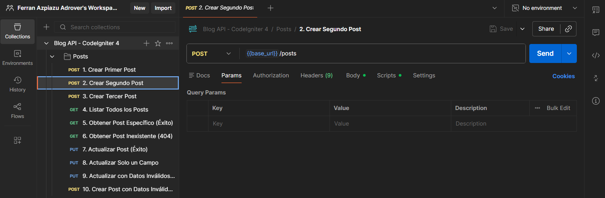

[](https://classroom.github.com/a/CwfLSOPe)
# 📝 Entrega: API RESTful para Blog - CodeIgniter 4 + SQLite

> 📚 **Proyecto Educativo**: API REST completa para gestionar posts de un blog

## 📋 Resumen del Trabajo Realizado

Este proyecto implementa una **API RESTful completa** utilizando **CodeIgniter 4** como framework y **SQLite** como base de datos. La API permite gestionar posts de un blog con operaciones CRUD (Create, Read, Update, Delete), búsqueda avanzada, validación de datos y manejo robusto de errores.

### ✨ Lo que se ha implementado

- ✅ **CRUD completo**: Crear, leer, actualizar y eliminar posts
- ✅ **Búsqueda de posts**: Búsqueda por término en título y contenido
- ✅ **Validación de datos**: Validación robusta en servidor con reglas personalizadas
- ✅ **Códigos HTTP apropiados**: 200, 201, 400, 404, 422, 500
- ✅ **Respuestas JSON consistentes**: Formato estándar en todas las respuestas
- ✅ **Base de datos SQLite**: Sistema sin servidor, ideal para desarrollo
- ✅ **Migraciones de base de datos**: Control de versiones del esquema
- ✅ **Documentación exhaustiva**: Múltiples guías y ejemplos
- ✅ **Pruebas funcionales**: Scripts y colecciones de Postman incluidas

### 🖼️ Capturas del Trabajo Realizado

El trabajo se ha validado con múltiples pruebas documentadas:


*Ejecución de comandos en terminal durante el desarrollo*


*Respuestas exitosas de la API mostrando posts listados*


*Demostración de actualización de posts con PUT*


*Manejo correcto de búsquedas sin resultados*


*Pruebas de la colección en Postman*

## 🔧 Adaptaciones para Windows

Debido a que el proyecto se desarrolló en un entorno Windows, fue necesario realizar las siguientes adaptaciones:

- **Script de pruebas migrado**: El script original `test_api.sh` (bash para Linux/Mac) fue **migrado a PowerShell** (`test_api_windows.ps1`) para garantizar compatibilidad nativa en Windows
- **Configuración de base de datos**: Se configuró SQLite como base de datos por defecto en lugar de MySQL
- **Rutas adaptadas**: Las rutas de archivos se han adaptado para funcionar correctamente en sistemas Windows

## 📚 Documentación

Este proyecto incluye documentación exhaustiva:

- **[DOCUMENTACION_PROYECTO.md](DOCUMENTACION_PROYECTO.md)** - Guía completa paso a paso del desarrollo
- **[README_API.md](README_API.md)** - Referencia rápida de endpoints y uso
- **[POSTMAN_TESTS.md](POSTMAN_TESTS.md)** - Guía detallada de pruebas con Postman
- **[ESTRUCTURA_PROYECTO.md](ESTRUCTURA_PROYECTO.md)** - Explicación de la estructura y arquitectura

## 🚀 Cómo Ejecutar el Proyecto

### Requisitos Previos

- PHP 8.1 o superior
- Composer
- SQLite3 (incluido por defecto en PHP)

### Pasos de Instalación y Ejecución

1. **Instalar dependencias** (si es necesario):
   ```bash
   composer install
   ```

2. **Ejecutar migraciones de base de datos**:
   ```bash
   php spark migrate
   ```

3. **Iniciar el servidor de desarrollo**:
   ```bash
   php spark serve
   ```

4. **Acceder a la API**:
   ```
   http://localhost:8080
   ```

### 🧪 Ejecutar Pruebas

**En Windows (PowerShell):**
```powershell
.\test_api_windows.ps1
```

**En Linux/Mac (Bash):**
```bash
bash test_api.sh
```

**Con Postman:**
1. Importa `Blog_API_Postman_Collection.json`
2. Ejecuta la colección completa con 17 pruebas incluidas
3. Ver guía: **[IMPORTAR_POSTMAN.md](IMPORTAR_POSTMAN.md)**

### 📝 Prueba Rápida Manual

```bash
# Crear un post
curl -X POST http://localhost:8080/posts \
  -H "Content-Type: application/json" \
  -d '{
    "title": "Mi Primer Post",
    "content": "Este es el contenido del post",
    "category": "Tecnología",
    "tags": ["php", "api"]
  }'

# Listar todos los posts
curl http://localhost:8080/posts

# Buscar posts
curl http://localhost:8080/posts/search?term=Tecnologia
```

## 📋 Endpoints de la API - Referencia Completa

| Método | Endpoint | Descripción | Código HTTP |
|--------|----------|-------------|-------------|
| GET | `/posts` | Listar todos los posts | 200 |
| GET | `/posts/{id}` | Obtener un post específico | 200 / 404 |
| POST | `/posts` | Crear un nuevo post | 201 / 400 / 422 |
| PUT | `/posts/{id}` | Actualizar un post | 200 / 404 / 422 |
| DELETE | `/posts/{id}` | Eliminar un post | 204 / 404 |
| GET | `/posts/search?term={palabra}` | Buscar posts por término | 200 |

**Ver [README_API.md](README_API.md) para ejemplos detallados de cada endpoint.**

## 🧪 Pruebas Realizadas

Este proyecto incluye varias formas de validar la funcionalidad:

### 1️⃣ Scripts de Prueba Automáticas
- `test_api_windows.ps1` - Script PowerShell para Windows
- `test_api.sh` - Script Bash para Linux/Mac

Ambos ejecutan 10 pruebas automáticas cubriendo:
- ✅ Crear múltiples posts
- ✅ Listar todos los posts
- ✅ Obtener posts específicos
- ✅ Búsqueda de posts
- ✅ Actualización de posts
- ✅ Validación de errores
- ✅ Eliminación de posts
- ✅ Manejo de IDs inválidos

### 2️⃣ Colección Postman
- **Archivo**: `Blog_API_Postman_Collection.json`
- **Incluye**: 17 pruebas con validaciones automáticas
- **Tests**: Incluye assertions para códigos HTTP, formatos JSON, y valores de respuesta
- **Pasos**: Ver [IMPORTAR_POSTMAN.md](IMPORTAR_POSTMAN.md)

### 3️⃣ Pruebas Manuales
Consulta [POSTMAN_TESTS.md](POSTMAN_TESTS.md) para una guía completa de pruebas manuales paso a paso.

## 🗂️ Estructura del Proyecto

```
blog-api/
├── app/
│   ├── Controllers/
│   │   └── Posts.php                    # Controlador con lógica de la API
│   ├── Models/
│   │   └── PostModel.php                # Modelo para acceso a datos
│   ├── Database/
│   │   └── Migrations/
│   │       └── 2025-11-05-122918_CreatePostsTable.php
│   ├── Config/
│   │   ├── Routes.php                   # Configuración de rutas
│   │   ├── Database.php                 # Configuración SQLite
│   │   └── [otros archivos de config]
│   └── Filters/
│
├── public/
│   ├── index.php                        # Punto de entrada de la aplicación
│   ├── images/                          # Capturas del proyecto
│   └── robots.txt
│
├── writable/
│   └── database/
│       └── blog.db                      # Base de datos SQLite
│
├── tests/                               # Pruebas unitarias
│
├── test_api.sh                          # Script de pruebas para Linux/Mac
├── test_api_windows.ps1                 # Script de pruebas para Windows ✨
├── Blog_API_Postman_Collection.json     # Colección de pruebas Postman
│
├── composer.json                        # Dependencias del proyecto
└── README.md                            # Este archivo
```

## 🎓 Conceptos Implementados

Este proyecto demuestra profundo conocimiento de:

- ✅ **Arquitectura MVC**: Separación clara entre modelos, vistas y controladores
- ✅ **Diseño RESTful**: Siguiendo convenciones HTTP y principios REST
- ✅ **Validación de datos**: Reglas de validación en servidor
- ✅ **Migraciones de BD**: Control de versiones del esquema
- ✅ **Códigos HTTP**: Uso correcto de 200, 201, 400, 404, 422, 500
- ✅ **SQLite**: Base de datos sin servidor para desarrollo
- ✅ **Respuestas JSON**: Formato consistente en todas las respuestas
- ✅ **Manejo de errores**: Errores descriptivos y estructurados
- ✅ **Seguridad**: Mass Assignment Protection y validación
- ✅ **Documentación**: Múltiples guías y ejemplos completos
- ✅ **Adaptabilidad**: Migración exitosa de Linux/Mac a Windows

## 📁 Archivos Clave del Proyecto

| Archivo | Descripción |
|---------|-------------|
| `app/Controllers/Posts.php` | Controlador con todos los endpoints de la API |
| `app/Models/PostModel.php` | Modelo que gestiona la tabla posts |
| `app/Config/Routes.php` | Definición de rutas de la API |
| `app/Config/Database.php` | Configuración de SQLite |
| `app/Database/Migrations/2025-11-05-122918_CreatePostsTable.php` | Creación de tabla posts |
| `writable/database/blog.db` | Base de datos SQLite con datos |
| `test_api_windows.ps1` | Script PowerShell para pruebas en Windows |
| `test_api.sh` | Script Bash para pruebas en Linux/Mac |
| `Blog_API_Postman_Collection.json` | 17 pruebas automáticas para Postman |

## 🔒 Server Requirements

PHP version 8.1 o superior, con las siguientes extensiones:

- [intl](http://php.net/manual/en/intl.requirements.php)
- [mbstring](http://php.net/manual/en/mbstring.installation.php)
- json (habilitado por defecto)
- [libcurl](http://php.net/manual/en/curl.requirements.php) para HTTP requests

> [!WARNING]
> - End of life PHP 7.4: Noviembre 28, 2022
> - End of life PHP 8.0: Noviembre 26, 2023
> - End of life PHP 8.1: Diciembre 31, 2025
> **Se requiere PHP 8.1 o superior**

## 📝 Notas sobre la Entrega

- ✅ La API es completamente funcional y ha sido probada
- ✅ Todas las operaciones CRUD funcionan correctamente
- ✅ La base de datos SQLite está correctamente configurada
- ✅ Se incluyen scripts de prueba automáticas para Windows (PowerShell)
- ✅ Se incluye colección de Postman con 17 pruebas
- ✅ Documentación exhaustiva en múltiples archivos
- ✅ Capturas del trabajo realizado en `/public/images/`
- ✅ Validación robusta de datos de entrada
- ✅ Manejo correcto de errores HTTP
